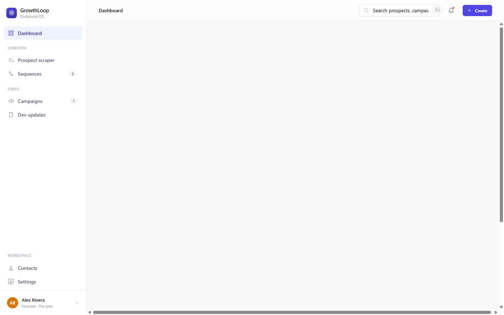
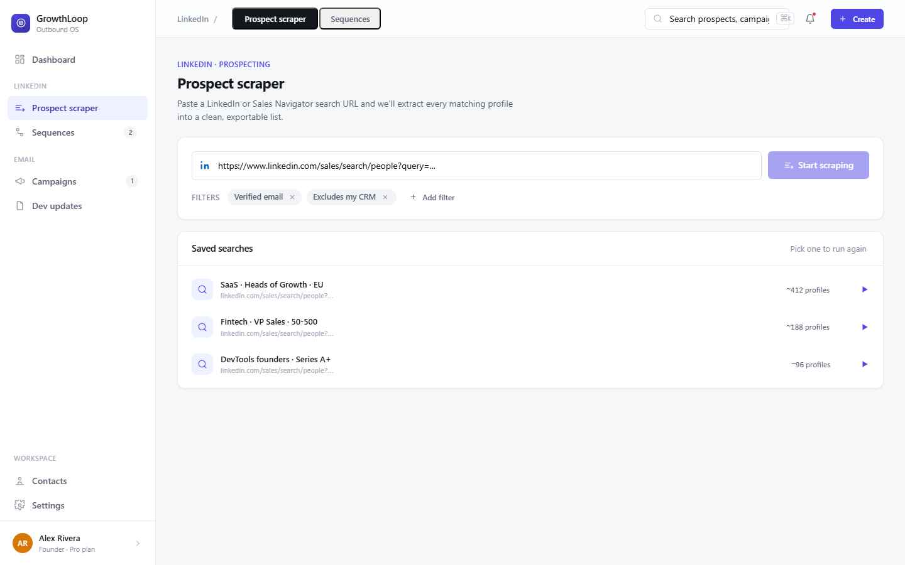

# GrowthLoop — Outbound OS

A browser-based outbound marketing platform for managing LinkedIn and email outreach campaigns.

## Tech Stack

- React 18 (UMD, loaded via CDN)
- Babel Standalone (JSX transpiled in-browser)
- Vanilla CSS (`styles.css`)
- No bundler or build tools required

## Getting Started

1. Clone the repository
2. Open `index.html` with a local HTTP server (required to avoid CORS issues)

```bash
# Python
python -m http.server 8080

# Node
npx serve .
```

3. Navigate to `http://localhost:8080`

## Project Structure

```
├── index.html              # Entry point
├── app.jsx                 # App shell, routing, and layout
├── components.jsx          # Shared UI components
├── icons.jsx               # Icon library
├── signin.jsx              # Authentication screen
├── data.js                 # Mock data
├── styles.css              # Global styles and design tokens
├── tweaks-panel.jsx        # UI customization panel (density, accent, layout)
├── views_dashboard.jsx     # Dashboard view
├── views_prospects.jsx     # Prospects and lists views
├── views_scraper.jsx       # LinkedIn scraper view
├── views_sequences.jsx     # LinkedIn sequences view
├── views_email.jsx         # Email campaigns view
├── views_email_wizard.jsx  # Campaign creation wizard
├── views_email_warmup.jsx  # Email warmup view
├── views_settings.jsx      # Settings view
└── views_updates.jsx       # Updates / activity feed view
```

---

## Vue d'ensemble du produit

GrowthLoop est une plateforme outbound unifiée qui orchestre la prospection LinkedIn et email, du scraping de leads jusqu'à l'automatisation des séquences et l'analyse des performances. Elle s'adresse aux founders, équipes sales et growth.

### Modules principaux

| Module | Sous-modules |
|--------|-------------|
| Prospects | Database, Lists, Monitor |
| LinkedIn | Scraper, Sequences |
| Email | Campaigns, Warmup |
| Dashboard | KPIs, Charts, Activity |
| Updates | Changelog, Email distribution |

---

## Prospect Engine

**Objectif UX :** L'utilisateur doit pouvoir importer, organiser et surveiller ses prospects sans friction.

### Scraper — Import LinkedIn

- L'utilisateur colle une URL Sales Navigator → GrowthLoop extrait et normalise automatiquement les profils
- Chaque profil contient : nom, titre, entreprise, email, localisation, industrie, connexions mutuelles
- Les recherches peuvent être sauvegardées et relancées pour surveiller les nouveaux entrants
- La déduplication est automatique à l'import → zéro doublon sans action manuelle
- Import CSV haute performance pour les listes +10k lignes

### Base de données

- Vue tableau avec recherche full-text sur tous les champs
- Filtres par : entreprise, titre, localisation, industrie, tags, appartenance à une liste
- L'UX doit permettre un filtrage rapide sans rechargement de page

### Lists

- Listes nommées avec indicateurs de santé : actif, bounced, désabonné
- L'utilisateur crée des segments ciblés pour les séquences ou campagnes

### Monitor

- Vue dédiée au suivi des comptes cibles dans le temps
- Signale les changements de poste, nouvelles entrées dans une recherche sauvegardée

---

## LinkedIn Outreach

**Objectif :** Construire des séquences multi-étapes visuellement, comme un flow builder, sans code.

### Séquence builder — 5 étapes clés

1. **Visite de profil** → signal d'intérêt passif avant contact
2. **Demande de connexion** → note personnalisée avec variables dynamiques `{{first}}` `{{company}}` `{{industry}}`
3. **Délai configurable** → pause N jours, respecte le fuseau horaire du prospect
4. **Message / InMail** → suivi aux connectés ou InMail aux non-connectés, avec templates
5. **Branches conditionnelles (v2.4+)** → split selon : a répondu / a accepté / tag personnalisé

### UX de sécurité & limites

- Plafonds journaliers visibles et configurables : connexions ≤ 40/j, messages ≤ 80/j, visites ≤ 150/j
- Fenêtre d'envoi : actions uniquement dans les heures définies par l'utilisateur
- Toggle weekend : activité samedi/dimanche en opt-in
- Pacing humain : délais aléatoires entre chaque action → évite la détection

### Analytics séquence

- Funnel par étape : envoyé → accepté → répondu
- Taux de réponse global, taux d'acceptation, meetings bookés
- Suivi du statut de chaque prospect dans le flow

---

## Email Campaigns

**Objectif :** Wizard guidé en 4 étapes pour lancer une campagne sans expertise technique.

### Workflow campagne

1. Définir l'audience (liste de prospects)
2. Composer le message (sujet + corps avec variables dynamiques)
3. Review avant envoi
4. Lancer

### Fonctionnalités

- Personnalisation : variables `{{company}}` `{{first}}` et champs custom dans le sujet ET le corps
- Providers supportés : Gmail (OAuth), Outlook/M365 (OAuth), SMTP custom
- États d'une campagne : `Draft → Scheduled → Sending → Completed`

### Email Warmup

- Montée progressive du volume d'envoi sur les nouveaux domaines
- Construit la réputation de l'expéditeur avant les campagnes cold

### Tracking & compliance

- Tracking ouvertures : pixel invisible
- Tracking clics : réécriture de liens
- Footer de désabonnement : opt-out 1 clic, auto-ajouté (recommandé, désactivable)
- Suppression automatique des adresses bouncées et désabonnées des envois futurs

---

## Dashboard & Analytics

**Objectif UX :** Visibilité cross-canal en un coup d'œil, sans changer d'outil.

- **KPI cards** : prospects scrapés, messages envoyés, taux de réponse, meetings bookés — chacun avec delta vs période précédente et sparkline
- **Graphique volume outbound** : messages envoyés + réponses sur les 14 derniers jours, area chart
- **Feed d'activité live** : flux en temps réel des réponses, acceptations, ouvertures, clics, meetings, désabonnements
- **Tableau campagnes actives** : vue cross-LinkedIn et email avec taux de réponse et statut
- **Funnels par étape (v2.3+)** : visualiser les drop-offs à chaque étape de séquence

---

## Intégrations

| Outil | Usage |
|-------|-------|
| Gmail | Envoi email OAuth |
| Outlook / M365 | Envoi email OAuth |
| LinkedIn | Séquences & scraper |
| Custom SMTP | Config serveur manuel |
| Slack | Alertes prospects & séquences |
| Sellsy CRM | Sync contacts & deals |

---

## Settings & Configuration

Contrôles niveau workspace accessibles aux admins :

- **Email config** : provider, identité expéditeur, plafond journalier, préférences de tracking
- **LinkedIn config** : compte connecté, plafonds journaliers, fenêtre d'envoi
- **Slack** : connecter le workspace pour les notifications outbound
- **Sellsy** : sync CRM pour contacts et deals
- **Apparence** : toggle dark/light, densité (comfortable/compact), couleur d'accent

---

## Screenshots

| Dashboard | Sequences | Email Campaigns |
|-----------|-----------|-----------------|
|  |  |  |
